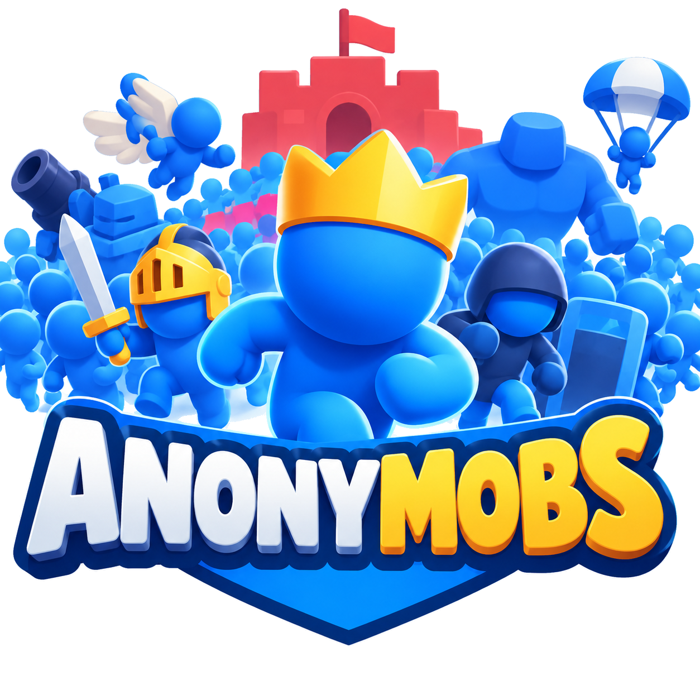

  

# anonymobs.org

This is the repository for the **[anonymobs.org](https://anonymobs.org)** website — a *Mob Control* clan &amp; strategy hub for the **Anonymobs** clan.

🔗 **Live site:** https://anonymobs.org

**Last updated:** September 7, 2026

## About

anonymobs.org is a static website (plain HTML/CSS/JS, no build step) that serves as a quick-reference and event playbook for the Anonymobs clan in Voodoo's *Mob Control*. It covers S-tier build recommendations for every event, plus a strategy playbook for looting, leveling cards, and climbing to God tier.

## The clan

**Clan ID:** `fe565cfc-8b3b-423c-83a0-b53a9147aec7`

### How to join

1. Open **Mob Control** and tap the **Clan** menu.
2. Hit **Search** and look up **"Anonymobs"** (or the Clan ID above), then request to join.
3. **Join before an event starts** and stay through reward-claim — you only keep a race's Sparks if you're in the same clan from start to claim. Leaving a clan makes your Sparks disappear.

### Ideal clan members

- Casual but fairly active
- Willing to participate in events from start to finish
- Keen to grow and learn in a fun environment

## File an issue

Found a bug or something wrong on the site? **[File an issue](https://github.com/jchristn/anonymobs.org/issues/new)** and we'll get it fixed.

## Submit an enhancement request

Have an idea to make the site better? **[Submit an enhancement request](https://github.com/jchristn/anonymobs.org/issues/new)** and we'll take a look.

## Development

No build tooling required — open `index.html` in a browser.

- `index.html` — page shell (topbar, hero, section containers)
- `styles.css` — styling (dark theme)
- `app.js` — data-driven rendering of every section
- `assets/` — logo and icons
